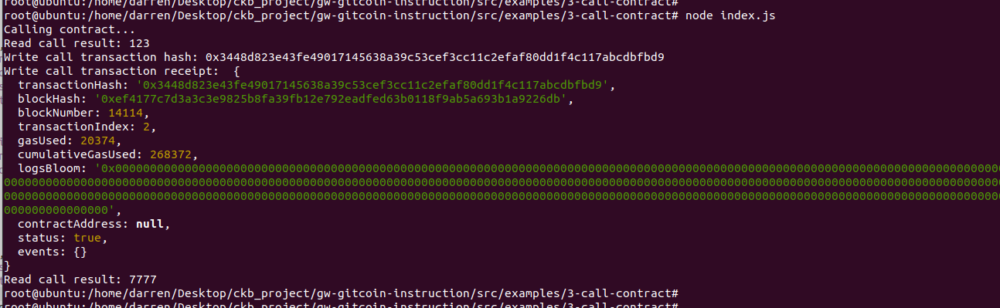

## 1. screenshot of issued a smart contract call


## 2. transaction hash
0x3448d823e43fe49017145638a39c53cef3cc11c2efaf80dd1f4c117abcdbfbd9

## 3. contract address
0x12D131F5b0D5B3C98dE5f3cc6167E399c0E63414

## 4. ABI for contract
```
    [{
      "inputs": [],
      "stateMutability": "payable",
      "type": "constructor"
    },
    {
      "inputs": [
        {
          "internalType": "uint256",
          "name": "x",
          "type": "uint256"
        }
      ],
      "name": "set",
      "outputs": [],
      "stateMutability": "payable",
      "type": "function"
    },
    {
      "inputs": [],
      "name": "get",
      "outputs": [
        {
          "internalType": "uint256",
          "name": "",
          "type": "uint256"
        }
      ],
      "stateMutability": "view",
      "type": "function"
    }]
```