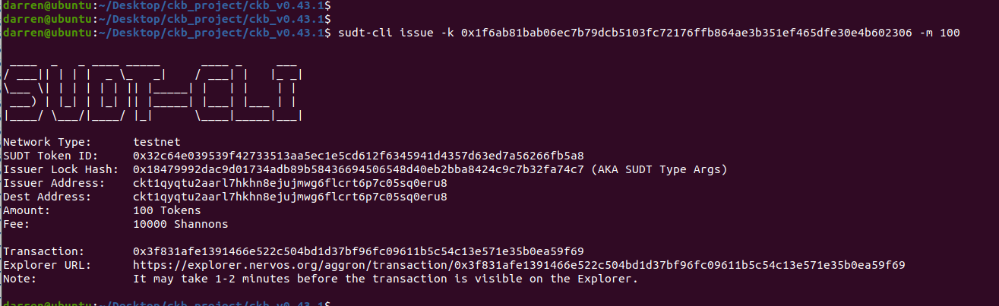

## 1. layer 1 address
[Testnet Explorer](https://explorer.nervos.org/aggron/address/ckt1qyqtu2aarl7hkhn8ejujmwg6flcrt6p7c05sq0eru8)

## 2. screenshot of create SUDT tokens on Layer 1

## 3. link to the transaction
[Testnet Explorer](https://explorer.nervos.org/aggron/transaction/0x3f831afe1391466e522c504bd1d37bf96fc09611b5c54c13e571e35b0ea59f69)

## 4. screenshot of deposit to Layer 2

## 5. SUDT ID
741