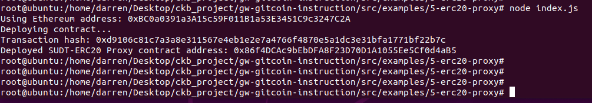
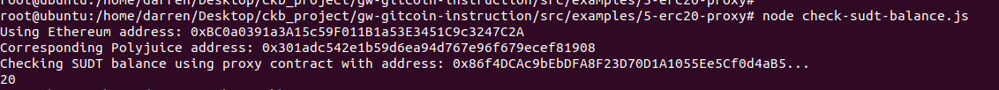

## 1. A screenshot of the console output immediately after deploying smart contract.

## 2. The address of the ERC20 Proxy Contract you deployed (in text format).
0x86f4DCAc9bEbDFA8F23D70D1A1055Ee5Cf0d4aB5

## 3. A screenshot of the console output immediately after checking your SUDT balance.

## 4.The Ethereum address that was checked (in text format).
0xBC0a0391a3A15c59F011B1a53E3451C9c3247C2A