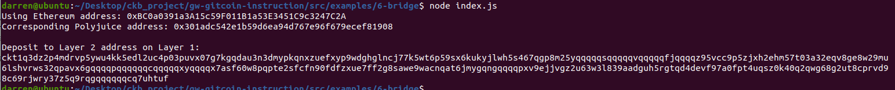

## 1. A screenshot of the console output immediately after you have successfully generated your Deposit Receiver Address.

## 2. Your Deposit Receiver Address (in text format).
ckt1q3dz2p4mdrvp5ywu4kk5edl2uc4p03puvx07g7kgqdau3n3dmypkqnxzuefxyp9wdghglncj77k5wt6p59sx6kukyjlwh5s467qgp8m25yqqqqqsqqqqqvqqqqqfjqqqqz95vcc9p5zjxh2ehm57t03a32eqv8ge8w29mu6lshvrws32qpavx6gqqqqpqqqqqqcqqqqqxyqqqqx7asf60w8pqpte2sfcfn90fdfzxue7ff2g8sawe9wacnqat6jmygqngqqqqpxv9ejjvgz2u63w3l839aadguh5rgtqd4devf97a0fpt4uqsz0k40q2qwg68g2ut8cprvd98c69rjwry37z5q9rqgqqqqqqcq7uhtuf

## 3. The Ethereum address used to generate the Deposit Receiver Address (in text format).
0xBC0a0391a3A15c59F011B1a53E3451C9c3247C2A

## 4. A link to the Etherscan explorer for the successful Force Bridge transaction. This can be found on Force Bridge under History→Succeed.
https://rinkeby.etherscan.io/tx/0x49e98aff5e7126289d13ef0086440628948cf1beaad62fab9dfefd727c1ba173

## 5. A link to the Nervos explorer for the successful Force bridge transaction. This can be found on Force Bridge under History→Succeed.
https://explorer.nervos.org/aggron/transaction/0xe09d2b0929ee30108c390429d032929f7dd5c15d3d2a85027a163a1a4a02474b